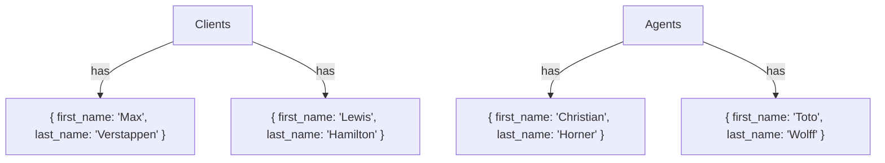

# MongoDb_SoftServe
## Schema on MongoDb

## Code on MongoDb
```json
{
  "clients": [
    {
      "_id": ObjectId("60d5f5b7e1d7c2045c5a0001"),
      "first_name": "Max",
      "last_name": "Verstappen",
      "email": "max.verstappen@redbullracing.com",
      "phone": "+31612345678",
      "registered_at": ISODate("2024-07-08T00:00:00Z")
    },
    {
      "_id": ObjectId("60d5f5b7e1d7c2045c5a0002"),
      "first_name": "Liam",
      "last_name": "Lawson",
      "email": "liam.lawson@redbullracing.com",
      "phone": "+64212345678",
      "registered_at": ISODate("2024-07-08T00:00:00Z")
    }
  ],
  "agents": [
    {
      "_id": ObjectId("60d5f5b7e1d7c2045c5b0001"),
      "first_name": "Christian",
      "last_name": "Horner",
      "email": "christian.horner@redbullracing.com",
      "phone": "+447123456789",
      "registered_at": ISODate("2024-07-08T00:00:00Z"),
      "commission_percentage": 7.5
    },
    {
      "_id": ObjectId("60d5f5b7e1d7c2045c5b0002"),
      "first_name": "Toto",
      "last_name": "Wolff",
      "email": "toto.wolff@mercedesamgf1.com",
      "phone": "+43198765432",
      "registered_at": ISODate("2024-07-08T00:00:00Z"),
      "commission_percentage": 8.0
    }
  ]
}
```
